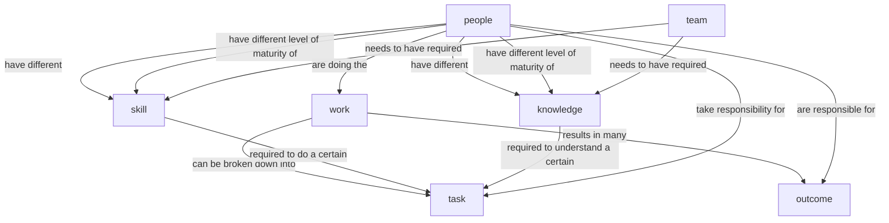
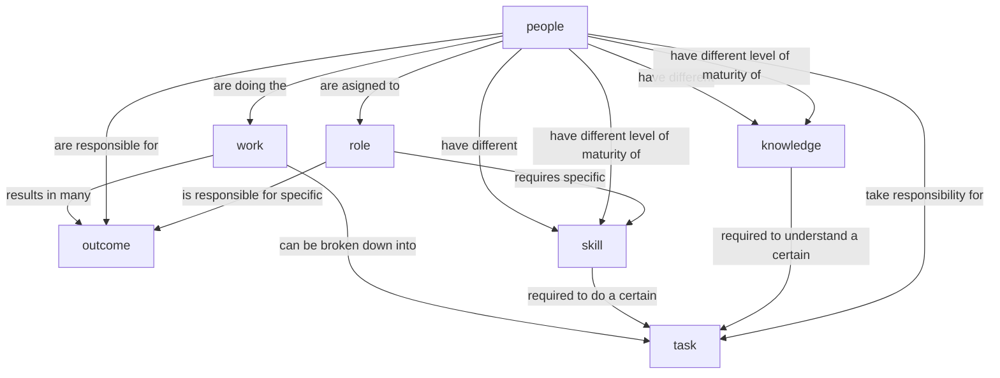

> [!tldr]
> Role descriptions are a useful tool for recruitment. But they are less appropriate to define and structure work and teams in an organization. They lack expressiveness when it comes to describe how work should be done in a team and who is responsible for what as there rarely is this exact mapping between tasks, skills and roles. There is overlap and there might be gaps. A software architect and a data architect both should be able to conduct domain modeling sessions. A frontend engineer should be able to do something in a backend system and vice versa. And all of them should be able to participate in QA tasks. Structuring teams by defining the required roles might result in
>
> * overstaffing of teams
> * unclear **responsibilities** as **people** derive their **tasks** from their **role** definition
> * unclear knowledge whether a team has all the **skills** it needs to get its **work** done
> * no information about the required **level of maturity** for certain **skills**
> * no information about redundancy of **skills**
>
>Use role descriptions for hiring. Use something like **skill-task** matrices and **key result areas** to clarify who is responsible for what **outcomes**. Make clear what **skills** are needed in a team and then let the team figure out how  to get their **work** done.

## True Sentences

* There is **work** that has to be done
* **Work** can be broken down into **tasks**
* **Work** done results in (many) **outcomes**
* There are **skills** required to do a certain **task**
* There is **knowledge** required to understand a certain **task**
* There are **people** doing the **work**
* Different **people** have different **skills**
* Different **people** have different **knowledge**
* **People** have to take responsibility for **tasks** they work on
* **People** are responsible for certain **outcomes**
* **People** have different levels of **maturity** in different **skills**
* **People** have different levels of **maturity** in different areas of **knowledge**
* Different **Tasks** require different **skills** with different levels of **maturity**
* A **Team** needs to have all the **skills** and **knowledge** necessary to get its **work** done

> [!note]
> Roles are a kind of 'static binding' of **skills** and **responsibilities** to **people**. And as with all static bindings it is quite inflexible when composing systems according to changing requirements

## With Roles

* **People** are assigned to **roles**
* A **role** is responsible for specific **outcomes**
* A **role** requires specific **skills**
* **Software Architect** is a **role**
* **Data Architect** is a **role**
* **Software Architects** tend to life in the **OLTP** world
* **Data Architects** tend to live in the **OLAP** world
* **Software Architects** shape the structure of **software systems**
* **Software Architectures** are derived / influenced by **domain models**
* **Data Architectures** are derived / influenced by **domain models**

## Towards Role Descriptions

* **Key Result Areas** are the main **responsibilities** or **outcomes** for which a **person** (or department) is **accountable/responsible** for.
* **Performance** of a **person** is described by evaluating the results within each **Key Result Area** assigned to the **person**
* **Role** descriptions outline the **tasks** and **outcomes**/**responsibilities** of a specific position
* **Role** descriptions are used during recruitment
* **Role** descriptions are not an appropriate tool for career path conversations or performance dialogs
* **Role** descriptions often focus on what a **person** is expected to do (**output**, **effort**)

## Example Role: Software Architect

### Skills

* designing software systems according to functional and not-functional requirements
* creating abstract representations of software systems
* documenting architectural aspects of a software system
* API design
* domain modelling
* coding / programming
* refactoring

### Knowledge

* design patterns (e.g. Facade, Repository, Observer, Entity, Value Object, Chain of Responsiblity, ...)
* architectural patterns and styles (e.g. monolith, microservices, SAGA, write ahead log, API Gateway, ...)
* architecture principles (e.g. SOLID, High Cohesion - Loose Coupling, Zero Trust, Conway's Law, Team Topologies, ...)
* architecture documentation (e.g. ARC42, ADRs, ...)
* architecture methods (e.g. AIM42, evolutionary architecture, ...)
* technology stacks and tools for frontend and backend development
* domain modeling
* software engineering methodologies (CI/CD, Lean, Agile, XP, SAFe)
* software- / architecture-metrics
* modeling languages (UML, C4, TOGAF, SysML, ...)

### Outcome Responsibilities

* [[Maintainability]], [[SystemStability|Stability]] and [[Evolvability]] of a software system (this is a shared responsibility with **all people** working on the system)
* Alignment of a software system with (technical) company guidelines and enterprise architecture

## Example Role: Product Owner

### Tasks

* Define and prioritize product backlog
* Align digitalization goals of domain with business strategy
* Communicate requirements to the team
* Manage stakeholder expectations
* Validate delivered outcomes against business needs
* Design conceptual domain models
* Design logical, and physical data models
* Define data governance and standards
* Ensure data interoperability across systems
* Optimize data storage and retrieval strategies
* Build and maintain data pipelines
* Implement ETL/ELT processes
* Ensure data quality and reliability
* Optimize data processing performance
* Develop and maintain software applications
* Implement APIs and integrations
* Write automated tests
* Ensure code quality and maintainability
* Define system architecture and technology stack
* Ensure alignment with enterprise architecture
* Review and approve design decisions
* Address not-functional requirements (scalability, security)

### PO Skills

* Backlog management
* Stakeholder communication
* Prioritization & negotiation
* Basic data literacy
* Agile product management
* Domain modeling (Event Storming, True sentences, Ontologies, ...)
* Data modeling (ER diagrams, normalization)
* Database design (SQL/NoSQL)
* Applying data governance principles
* Applying integration architecture patterns
* Programming (Python, TypeScript, Java, SQL, ...)
* ETL tools (Airflow, dbt)
* Usage of cloud data services (Azure, AWS, GCP)
* Performance tuning
* API design (REST, GraphQL)
* Implementing CI/CD pipelines
* Unit and integration testing
* Architectural design (microservices, event-driven)
* Performing technology evaluations
* Performing risk analysis
* Communication and documentation of system architectures

### PO Knowledge

* Domain-specific concepts, relations, events and business processes
* Company strategy and KPIs
* Agile frameworks (Scrum/Kanban/xP/...)
* Understanding of data-driven decision-making
* Domain data semantics
* Enterprise data architecture patterns
* Regulatory compliance (GDPR, etc.)
* Metadata management
* Data formats (Parquet, JSON, CSV)
* Streaming vs batch processing
* Data quality frameworks
* Domain-specific data sources
* Domain-specific application logic
* Software design patterns
* Security best practices
* Agile development practices
* Domain system landscape
* Architectural patterns
* Performance and security principles
* Cloud-native architecture

### Outcome responsibilities

* Clear, prioritized backlog
* Business value delivered incrementally
* Stakeholder satisfaction
* Measurable impact on domain digitalization goals
* Scalable and consistent data architecture
* High-quality, well-documented data models
* Compliance with governance and security standards
* Reliable, performant data pipelines
* Clean, accessible data for analytics
* Minimal downtime and data loss
* Functional, tested software components
* Maintainable and scalable codebase
* Integration with data and domain systems
* Robust, scalable architecture
* Technology choices aligned with strategy
* Reduced technical debt and risks

### ✅ **Tasks**

1. **Define Domain Data Strategy**

    * Align with organizational data mesh principles.
    * Identify key data products for the domain.
2. **Design Data Products**

    * Define schemas, contracts, and interoperability standards.
    * Ensure compliance with governance and quality rules.
3. **Build & Deploy Data Products**

    * Implement pipelines for ingestion, transformation, and serving.
    * Automate testing and monitoring.
4. **Consume Data Products**

    * Integrate external domain data products into domain workflows.
    * Validate and enrich data for domain-specific use cases.
5. **Ensure Data Governance**

    * Apply security, privacy, and compliance policies.
    * Manage metadata and lineage.
6. **Monitor & Improve**

    * Track SLAs, data quality metrics, and usage patterns.
    * Optimize performance and cost.
7. **Collaborate & Evangelize**

    * Communicate with other domain teams.
    * Share best practices and contribute to mesh standards.

### **Data Governance Tasks**

#### **1. Define Governance Policies**

* Establish domain-specific rules for data quality, security, and compliance.
* Align with federated governance standards of the data mesh.

#### **2. Metadata Management**

* Create and maintain metadata for all data products.
* Ensure discoverability through a central catalog (e.g., data product registry).

#### **3. Data Quality Management**

* Define and enforce quality metrics (accuracy, completeness, timeliness).
* Implement automated validation and monitoring.

#### **4. Access Control & Security**

* Set up role-based access and permissions for data products.
* Apply encryption and secure transmission protocols.

#### **5. Compliance & Privacy**

* Ensure adherence to GDPR, CCPA, and industry-specific regulations.
* Implement data masking and anonymization where needed.

#### **6. Lineage & Traceability**

* Track data flow from source to consumption.
* Provide lineage information for auditing and impact analysis.

#### **7. SLA & Contract Management**

* Define service-level agreements for data products (availability, freshness).
* Manage data contracts between producer and consumer domains.

#### **8. Monitoring & Auditing**

* Continuously monitor governance compliance.
* Maintain audit logs for regulatory and internal reviews.

#### **9. Incident Management**

* Define processes for handling data breaches or quality issues.
* Communicate incidents and resolutions transparently.

#### **10. Governance Evangelism**

* Educate domain team members on governance principles.
* Promote best practices across domains.

---

### ✅ **Skills**

* **Data Modeling & Architecture**
  * Domain-driven design for data.
* **ETL / ELT Development**
  * Building scalable pipelines.
* **Cloud & Platform Engineering**
  * Familiarity with data platforms (e.g., Snowflake, Databricks).
* **Data Governance & Security**
  * Implementing policies and access control.
* **Testing & Automation**
  * CI/CD for data products.
* **Communication & Collaboration**
  * Cross-domain alignment and stakeholder management.

---

### ✅ **Knowledge**

* **Domain Knowledge**
  * Deep understanding of the business domain.
* **Data Mesh Principles**
  * Federated governance, product thinking.
* **Data Quality & Observability**
  * Metrics, lineage, and monitoring.
* **Regulatory Compliance**
  * GDPR, industry-specific rules.
* **Interoperability Standards**
  * APIs, contracts, semantic consistency.

---

### ✅ **Outcome Responsibilities**

* **High-quality Data Products**
  * Reliable, discoverable, interoperable.
* **Domain Data Strategy Execution**
  * Clear roadmap and measurable impact.
* **Compliance & Security**
  * No breaches, full auditability.
* **Cross-domain Collaboration**
  * Smooth data exchange and shared standards.
* **Continuous Improvement**
  * Regular updates, performance optimization.

---

## Software Architect Role

### 🧭 Role Definition: Software Architect

**Purpose:**  
Ensure that the **team has the architecture capability** (skills, decisions, artifacts, guardrails) to **turn business goals into reliable, evolvable software systems**—safely, sustainably, and at speed.

**Core mandate:**

* **Own architectural outcomes** (system qualities, architectural coherence, decision clarity, risk posture)
* **Enable teams** to deliver by providing **structure, standards, decisions, and coaching**
* **Continuously align** technology with business goals and constraints

---

### 🔧 Work → Tasks → Outcomes

#### 1) **Work** (What the architect ensures happens)

* The system is **fit for purpose**: scalable, secure, maintainable, cost-aware
* Teams can build **consistently and independently** within guardrails
* Decisions are **documented, explainable, and reversible** when needed
* Risks are **anticipated, tracked, and mitigated**

#### 2) **Tasks** (What the architect actually does)

* **Clarify architectural drivers**: business goals, constraints, quality attributes (e.g., latency, resilience, data privacy)
* **Define target architecture and roadmap** (current state → interim states → target)
* **Make and record architecture decisions** (ADRs) and enforce **non-negotiable guardrails**
* **Design key structures**: domain boundaries, APIs, deployment topologies, data flows, integration patterns
* **Select and standardize technologies**: platforms, cloud services, data stores, runtime, observability
* **Model and analyze quality attributes**: performance budgets, resilience patterns, threat modeling
* **Set engineering standards**: coding conventions, CI/CD pipelines, branching, testing strategy, observability
* **Review and coach**: PRs, designs, prototypes; run architecture katas and risk reviews
* **Align stakeholders**: product, security, data, operations, finance, compliance
* **Measure and improve**: DORA metrics, reliability SLAs, cost/perf, change failure rate

#### 3) **Outcomes** (What the architect is **responsible** for)

* **System Quality Outcomes**
  * Reliability (SLOs/SLA adherence), performance budgets met
  * Security posture (threat model applied, critical vulns remediated)
  * Evolvability (modular boundaries, cognitive load manageable)
  * Cost effectiveness (TCO and unit economics visible and optimized)
* **Decision & Clarity Outcomes**
  * ADRs exist and are discoverable; decision latency low
  * Team understands “**how we build here**” (guardrails, patterns, standards)
* **Delivery Outcomes**
  * Reduced rework/misalignment; teams able to deliver independently
  * Risks closed before code freeze; architectural runway available
* **Alignment Outcomes**
  * Business goals trace to architecture drivers and trade-offs
  * Compliance requirements mapped to controls and evidence

> **Ownership Note:** Outcomes are owned by the architect, but **delivered collaboratively** with teams. The architect is responsible for **clarity, coherence, and risk posture**, not for “writing all the code.”

---

### 🧠 Knowledge (What the architect must understand)

* **Business & Domain Knowledge**
  * Domain concepts, bounded contexts, value streams
  * Regulatory environment (e.g., GDPR, ISO 27001), risk appetite, SLAs
* **Architecture & Design Knowledge**
  * Architectural styles (event-driven, microservices, layered, serverless)
  * Integration & messaging, data architecture, caching strategies
  * Cloud-native patterns, infrastructure-as-code, observability
  * Trade-off analysis (latency vs. throughput, consistency vs. availability)
* **Platform & Operations Knowledge**
  * CI/CD, platform engineering, IaC, deployment strategies (blue/green, canary)
  * SRE basics: SLOs, error budgets, incident management, postmortems
* **Security & Privacy Knowledge**
  * Threat modeling (STRIDE), authN/authZ patterns, secrets management
  * Data classification, encryption in transit/at rest, auditability
* **Financial Knowledge**
  * Cost modeling, unit economics (per-request, per-tenant), capacity planning

---

### 🛠️ Skills (What the architect must be able to do)

#### Technical Skills

* Systems design, API design, domain modeling
* Cloud architecture (AWS/Azure/GCP), networking basics
* Data modeling and storage selection (OLTP/OLAP, streaming, indexing)
* Observability (logs, metrics, traces), performance engineering
* Security-by-design, threat modeling, privacy-preserving design
* Platform engineering familiarity (pipelines, artifacts, environments)

#### Analytical & Decision Skills

* Trade-off analysis under constraints (time, budget, risk)
* Decomposition (modularity, team boundaries, cognitive load)
* Risk identification & mitigation; scenario planning

#### Leadership & Communication Skills

* Facilitation across roles (product, security, ops, finance)
* Writing ADRs & architecture docs others want to read
* Coaching teams; mentoring senior engineers
* Negotiation and conflict resolution; consensus-building

#### Delivery & Governance Skills

* Define and run **architecture guardrails** (linting, templates, checks)
* Knife-edge decisions: when to standardize vs. allow divergence
* Introduce change safely (migration plans, strangler patterns)

---

### 🧩 People: Maturity & Responsibility

### Skill Maturity (Example scale: 1–5)

* **1 – Novice:** Understands patterns; needs guidance to apply
* **2 – Advanced Beginner:** Can design small components
* **3 – Competent:** Designs services; balances trade-offs with support
* **4 – Proficient:** Designs subsystems; anticipates cross-cutting issues
* **5 – Expert:** Shapes system-of-systems; mentors architects

> Architects rarely sit at **5** across all skills. The role is to **assemble team capability** so the **team as a whole** covers the maturity needed by the **tasks**.

#### Responsibility Model (RACI flavor)

* **Architect:** Accountable for architectural outcomes; Responsible for decisions/guardrails
* **Engineers:** Responsible for implementation; Consulted on decisions; Own code quality
* **Product/Security/Ops/Data:** Consulted/Approving depending on area (e.g., security controls)

---

### 🗺️ Scope Variants of the Role

* **Solution Architect:** One product/solution, deep collaboration with delivery teams
* **Enterprise Architect:** Portfolio-level, standards, cross-cutting policies
* **Data/AI Architect:** Pipelines, governance, model ops, bias/ethics, lineage
* **Platform Architect:** Developer platform, CI/CD, infra abstractions, golden paths

Given your context (Data & AI team), the **Data/AI Architect** angle likely matters: **data governance, lineage, model observability, reproducibility, and responsible AI** need explicit outcomes and guardrails.

---

### 📚 Typical Artifacts & Tasks (with outcomes)

* **Architecture Decision Records (ADRs):** Decisions + context + consequences → reduces decision ambiguity and rework
* **Context + Container + Component diagrams (C4):** Shared map → improves onboarding and alignment
* **Quality Attribute Scenarios:** “X% requests under Y ms, degradation plan” → measurable architecture
* **Threat Model + Security Controls Map:** Risks & mitigations → auditability, fewer incidents
* **Runbooks, SLOs, Error Budgets:** Operational readiness → faster incident resolution
* **Tech Radar & Standards:** Approved tech & patterns → reduced cognitive load, safer choices
* **Migration Plans & Roadmaps:** Stepwise change → lowers risk, avoids big-bang failures

---

### 🎯 How to Measure Architectural Effectiveness

* **Delivery Metrics (DORA):** Deployment frequency, lead time, change failure rate, MTTR
* **Reliability Metrics:** SLO/SLA adherence, incident rate, severity trend
* **Quality & Maintainability:** Defect escape rate, PR cycle time, architecture violations
* **Cost & Efficiency:** Cloud cost per unit of value (per request/tenant/pipeline run)
* **Decision Flow:** Time-to-decision, percentage of decisions documented, rework due to unclear decisions
* **Team Health:** Cognitive load, autonomy within guardrails, satisfaction with standards

---

### ⚠️ Common Anti-Patterns (and fixes)

* **Ivory Tower Architecture:** Decisions without delivery involvement → **Fix:** co-design with engineers; ADRs + prototypes
* **Over-Engineering:** Gold-plating on non-critical attributes → **Fix:** quality attributes tied to business goals
* **Standard Sprawl / Tool Chaos:** Too many tools → **Fix:** tech radar, golden paths, deprecation policy
* **“Architect as Gatekeeper” Only:** Blocking vs. enabling → **Fix:** shift to enablement, coaching, automated guardrails
* **No Decision Log:** Tribal memory → **Fix:** ADR habit + searchable repository
* **Architecture by PowerPoint:** No executable artifacts → **Fix:** reference implementations, templates, scaffolding

---

### 🧱 Mapping to Your Mental Model (Quick Matrix)

| Concept            | For a Software Architect                                                              |
| ------------------ | ------------------------------------------------------------------------------------- |
| **Work**           | Ensure system architecture enables sustainable delivery aligned to business goals     |
| **Tasks**          | Drivers → Decisions → Structure → Standards → Coaching → Measurement                  |
| **Outcomes**       | Quality attributes met; clarity & guardrails; reduced risk; business alignment        |
| **Skills**         | Design, cloud, data, security, platform, trade-offs, facilitation                     |
| **Knowledge**      | Domain, compliance, cost, SRE, architectural styles & patterns                        |
| **People**         | Assemble maturity across the team; mentor; align stakeholders                         |
| **Responsibility** | Accountable for architectural outcomes and decision clarity; not for writing all code |
| **Maturity**       | Varied across skills; uses guardrails and teaming to compensate                       |

---

### ✅ Practical Checklist (what “good” looks like)

* [ ]  Architecture drivers (business + quality attributes) are explicit and prioritized
* [ ]  ADRs exist for all significant decisions; discoverable in repo
* [ ]  C4 diagrams for context, containers, components kept current via CI
* [ ]  Guardrails codified (lint rules, templates, pipelines, security checks)
* [ ]  SLOs, error budgets, and runbooks defined and owned
* [ ]  Threat model documented; critical controls enforced and monitored
* [ ]  Tech radar + golden paths published; deprecation policy clear
* [ ]  Roadmap for migrations with incremental milestones
* [ ]  Metrics tracked (DORA + reliability + cost + decision flow)
* [ ]  Regular architecture reviews/katas; coaching embedded in delivery

---
